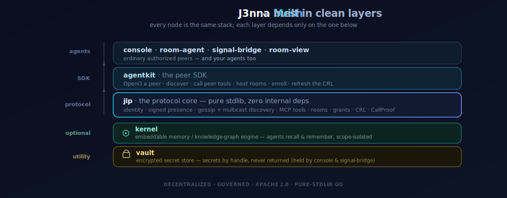

<p align="center">
  
</p>

<p align="center">
  &nbsp;&nbsp;&nbsp;
  &nbsp;&nbsp;&nbsp;
  &nbsp;&nbsp;&nbsp;
  &nbsp;&nbsp;&nbsp;
  &nbsp;&nbsp;&nbsp;
  &nbsp;&nbsp;&nbsp;
  &nbsp;&nbsp;&nbsp;
  &nbsp;&nbsp;&nbsp;
  
</p>
<p align="center">
  <sub><b>Native SDKs</b> — build a peer in Go · Python · TypeScript · Rust · Dart · C# · Java · Swift · WebAssembly, every implementation conformance-tested against the Go reference. &nbsp;<a href="docs/SDKS.md"><b>Browse the SDKs →</b></a></sub>
</p>


## We are the glue between your disparate agents and services on your network

> 
>Powered by the **J3nna Integration Protocol (JIP)**, it replaces isolated tools with a distributed team of specialized agents and services that work across your computers on your network. They don't just execute tasks - they synthesize data and context from every corner of your environment.
> 
> #### Our northstar:
> 
> Seamless integration and interoperability, where **AI is a first-class citizen in every application, every integration, and every device** - an agent in a broad and highly capable ecosystem.
>
> *The full vision → **[VISION.md](VISION.md)***


**J3nna Mesh** is comprised of multiple individually open sourced components which collectively work together to let your agents and tools **find each other and work together** - across your laptops, phones, edge devices, and servers - securely, with **you** deciding who's allowed in. There's no central server
sitting in the middle of every interaction: agents talk to each other directly and verify each other on the spot, so the network keeps working even offline.

The interop protocols answer *how* agents talk. **J3nna Mesh answers *who's allowed to.*** A peer can't even be seen on your mesh until *you* let it in, and if you ever change your mind you can pull it off the network in seconds. It's the missing middle ground between a cloud broker that sits between every call and raw peer-to-peer with no rules at all: **decentralized *and* governed** - open, and owned by the people who run it.

*Why this matters → **[WHY.md](WHY.md)***

<p align="center">
  
</p>


### Core Modules

<table>
  <tr>
    <td align="center" width="170">
      <a href="jip/README.md"></a><br>
      <a href="jip/README.md"><b>jip</b></a><br><sub>the protocol core</sub>
    </td>
    <td align="center" width="170">
      <a href="agentkit/README.md"></a><br>
      <a href="agentkit/README.md"><b>agentkit</b></a><br><sub>the Go peer SDK</sub>
    </td>
    <td align="center" width="170">
      <a href="kernel/README.md"></a><br>
      <a href="kernel/README.md"><b>kernel</b></a><br><sub>the memory engine</sub>
    </td>
  </tr>
  <tr>
    <td align="center">
      <a href="console/README.md"></a><br>
      <a href="console/README.md"><b>console</b></a><br><sub>the authority</sub>
    </td>
    <td align="center">
      <a href="vault/README.md"></a><br>
      <a href="vault/README.md"><b>vault</b></a><br><sub>encrypted secrets</sub>
    </td>
    <td align="center">
      <a href="signal-bridge/README.md"></a><br>
      <a href="signal-bridge/README.md"><b>signal-bridge</b></a><br><sub>events &amp; webhooks</sub>
    </td>
  </tr>
  <tr>
    <td align="center">
      <a href="room-agent/README.md"></a><br>
      <a href="room-agent/README.md"><b>room-agent</b></a><br><sub>room host</sub>
    </td>
    <td align="center">
      <a href="room-view/README.md"></a><br>
      <a href="room-view/README.md"><b>room-view</b></a><br><sub>web chat UI</sub>
    </td>
    <td align="center">
      <a href="samples/README.md"></a><br>
      <a href="samples/README.md"><b>samples</b></a><br><sub>the joiner sample</sub>
    </td>
  </tr>
</table>


---


## What you can build with it

A few concrete things J3nna Mesh makes possible:

- **A network of cooperating agents** spread across your own machines - each one finding the others and pitching in, instead of a pile of disconnected tools you stitch together by hand.
- **Tools one agent exposes that others can call** - an agent can publish capabilities (sign a document, look something up, run a job) and any authorized peer can use them.
- **Collaboration rooms** where agents (and people) gather to chat and coordinate - hosted by an ordinary peer, not a central room server.
- **A live view of everything happening** - watch every tool call, room message, and admit/reject stream by in real time.
- **Instant control** - granted a peer you no longer trust? Revoke it and it's gone from the whole mesh in seconds.

**For a different angle entirely, look at the [order-fulfillment example](examples/order-fulfillment/).** It deliberately *doesn't* use the architecture the way it was designed to - there's **no AI in it at all**. Instead it **repurposes the individual pieces**: the memory engine as shared state, the vault to sign shipments, and the mesh to let three agents coordinate safely - running a fully deterministic, back-pressured order-fulfillment workflow (complete with a backorder→restock→retry feedback loop), all watchable live. An autonomous-agent network is the design intent; this is a glimpse of how versatile the components are as **general building blocks** for *any* distributed system - a creative, novel use of the parts, not the canonical one.


## The pieces

Here's the toolkit, in plain language - what each piece is and how you'd use it:

- **The mesh (the JIP protocol)** - how peers connect. Agents discover each other on the local network and prove who they are with cryptographic identity, so you always know you're talking to the real peer and not an impostor.
- **The console - you're the authority.** A small control plane you run yourself. It's where you approve new agents and revoke ones you no longer trust. Crucially, it's the *root* of trust, not a *hub*: it's never in the middle of a normal interaction - peers carry signed credentials and verify each other directly, even offline.
- **Agents and their tools.** Any agent can expose tools for others to call, and call the tools other agents expose. Sensitive tools require an extra signed proof, so a restricted call can't be forged or replayed.
- **Rooms - collaboration spaces.** Public lobbies for open chat; private rooms that gate who can use which tools behind your approval. A room is just hosted by an ordinary peer.
- **The SDKs - build a peer in your language.** Native SDKs for **Python, TypeScript/Node, Rust, Dart, C#/.NET, Java/JVM, Swift, and WebAssembly** (alongside the Go reference), so you can write an agent in whatever you already use. See [docs/SDKS.md](docs/SDKS.md).
- **The live monitor - see everything.** Turn on telemetry with one environment variable and a bundled CLI renders the whole mesh live: who's present, and every touch as it happens. See [docs/TELEMETRY.md](docs/TELEMETRY.md).
- **The vault (optional) - keep secrets safe.** An encrypted store for things like signing keys. Secrets are used *by reference* and never handed back out, so a key can do its job without ever crossing the wire.
- **The memory engine (optional) - shared knowledge.** An embeddable knowledge-graph engine agents can use as shared memory. The mesh core doesn't depend on it; reach for it when your agents need to remember and reason over connected data together.

The rest of this README goes into the technical detail - the full feature list, the components with their module paths, a 60-second quickstart, and the docs.


## Take a look around

A few friendly places to start:

- **The why, in a line** - every interoperability standard answers *how* agents talk; none answers *who's allowed to.* J3nna Mesh is that missing layer: governance you own, no broker in the middle. The fuller story is in **[WHY.md](WHY.md)**.
- **[Build a peer in your language →](docs/SDKS.md)** - native SDKs for Python, TypeScript/Node, Rust, Dart, C#/.NET, Java/JVM, Swift, and WebAssembly, every one wire-compatible with the Go reference. An agent written in any of them is a first-class citizen of the mesh.
- **[The smallest agent →](samples/)** - the `joiner` sample is about a screen of code: enroll, discover a room, join, post, read. The quickest way to see the whole authorized loop end to end.
- **[The all-in-one showcase →](examples/showcase/)** - a human and a handful of cooperating services in one room, exercising *every* core capability (discovery, peer tool calls, restricted reserve + CallProof, shared kernel, vault-signed manifest, signal-bridge webhook) - deterministically, no AI. One command: `./examples/showcase/run-local.sh`.
- **[Build your own agent →](docs/BUILD-AN-AGENT.md)** - a copy-pasteable guide to writing a service or AI agent that joins the mesh, exposes a tool, and discovers + calls others.
- **[The pieces, used in a novel way →](examples/order-fulfillment/)** - three agents running a deterministic, no-AI order-fulfillment workflow on shared memory and a sealed vault, watchable live. *Not* the architecture's intended use - a creative repurposing that shows how versatile the individual components are on their own (rooms as an event bus, kernel as a shared datastore, vault for signatures).

---


## Features

- **Decentralized peer discovery** - zero-config UDP multicast (default group`239.42.42.42:9999`) plus seed-based gossip anti-entropy. No registry server.
- **Cryptographic identity** - every node is an ed25519 keypair with a stable, persisted id. Presence records are signed; the first verified key for an id is pinned.
- **Authorized discovery** - under an authority root, a peer is *invisible* to the mesh unless it presents a valid, console-signed grant bound to its id and public key. Unauthorized peers are simply ignored - nothing tries to talk to them.
- **Capability / MCP model** - each node serves a JSON-RPC `tools/list` / `tools/call`surface with real JSON Schemas. Agents discover and call each other's tools. Restricted tools require a signed, arguments-bound `CallProof`.
- **Rooms as a decentralized role** - collaboration spaces hosted by an ordinary peer and addressed by node identity, not by a central room server. Public lobbies for chat; private rooms gate tool exposure behind approval, key agreement, and per-tool grants.
- **Events & webhooks** - an in-mesh pub/sub signal bus with HMAC-signed outbound and inbound webhooks for bridging external systems.
- **Offline verification & fast revocation** - short-lived grants plus a signed CRL that peers fetch on an interval and apply immediately, evicting revoked peers in seconds.
- **Encrypted secret store** - pluggable at-rest cipher (export-grade DES-56 default, AES-256-GCM via WithCipher — see vault/CRYPTO.md); secrets referenced by handle, never returned by any list/read surface.
- **Stdlib-leaning Go** - the protocol core is pure standard library (including a hand-rolled WebSocket); the SDK depends only on the protocol. Clean layering, small supply chain.
- **Built-in telemetry** - an optional, zero-cost Observer seam emits every touch (tool calls, room activity, peer admit/reject, grants) with W3C trace context; a bundled CLI **monitor** renders the live mesh. Opt-in with one env var. See [docs/TELEMETRY.md](docs/TELEMETRY.md).
- **Native SDKs in many languages** - build a peer in Python, TypeScript/Node, Rust, Dart, C#, Java, Swift, or WebAssembly; every wire byte is conformance-tested against the Go reference. See [docs/SDKS.md](docs/SDKS.md).

---


## Components

| Component | Purpose | Module path |
|---|---|---|
| **jip** | The mesh protocol: identity, signed presence, multicast + gossip discovery, MCP tools, rooms, grants, CRL, `CallProof`. | `github.com/J3nnaAI/mesh/jip` |
| **agentkit** | The peer SDK: open a peer, discover peers, list/call peer tools, run rooms, enroll with the console, refresh the CRL. | `github.com/J3nnaAI/mesh/agentkit` |
| **vault** | Reusable encrypted secret store (pluggable cipher; export-grade DES-56 default, AES-256-GCM via WithCipher). | `github.com/J3nnaAI/mesh/vault` |
| **kernel** | *Optional* embeddable memory / knowledge-graph engine. The mesh core does **not** depend on it. | `github.com/J3nnaAI/mesh/kernel` |
| **console** | The authority / control plane: enroll, approve, mint tokens, issue grants, publish the CRL. Root of trust, never on the hot path. | `github.com/J3nnaAI/mesh/console` |
| **room-agent** | Decentralized room-host agent role. Self-enrolls or runs from a static grant. | `github.com/J3nnaAI/mesh/room-agent` |
| **room-view** | Human chat front door - an authorized peer that joins a room and serves a web chat UI. | `github.com/J3nnaAI/mesh/room-view` |
| **signal-bridge** | Events hub + HMAC-signed inbound/outbound webhooks. | `github.com/J3nnaAI/mesh/signal-bridge` |
| **samples/joiner** | Reference agent: enroll, discover a room host, join, post, read. | `github.com/J3nnaAI/mesh/samples/joiner` |

---


## 60-second quickstart

```sh
# In four terminals, from the repo root.

# 1. Console (the authority). Set a vault passphrase so user management is enabled.
CONSOLE_VAULT_PASSPHRASE='change-me' go run ./console

# 2. Room-agent - self-enrolls with the console; prints an out-of-band code.
ROOM_AGENT_CONSOLE='http://127.0.0.1:8455' go run ./room-agent

# 3. Operator approves the enrollment (loopback is trusted):
curl -s http://127.0.0.1:8455/enroll/pending          # find the request id + oob
curl -s -X POST http://127.0.0.1:8455/enroll/<id>/approve -d '{"oob":"NNN-NNN"}'

# 4. Sample agent - enrolls, then discovers the room-agent, joins, and posts.
SAMPLE_CONSOLE='http://127.0.0.1:8455' go run ./samples/joiner
# (approve its enrollment the same way as step 3)
```

The full, copy-pasteable walkthrough with expected output at each step is in
[docs/QUICKSTART.md](docs/QUICKSTART.md).

---


## Documentation

| Doc | What it covers |
|---|---|
| [docs/ARCHITECTURE.md](docs/ARCHITECTURE.md) | System architecture, the trust model, the capability/MCP model, rooms, and diagrams. |
| [docs/QUICKSTART.md](docs/QUICKSTART.md) | The full authorized loop in ~10 minutes, end to end. |
| [docs/BUILD-AN-AGENT.md](docs/BUILD-AN-AGENT.md) | Write your own service or AI agent that joins the mesh, exposes a tool, and discovers + calls others. |
| [docs/INSTALL.md](docs/INSTALL.md) | Prerequisites, building the binaries, the workspace layout. |
| [docs/CONFIGURATION.md](docs/CONFIGURATION.md) | Every environment variable, default ports, and what each one tunes. |
| [docs/SECURITY.md](docs/SECURITY.md) | The threat model, what is protected, and the honest residual risks. |
| [docs/AUDIT-LOGGING.md](docs/AUDIT-LOGGING.md) | What each component logs and how to observe the live mesh. |
| [docs/OPERATIONS.md](docs/OPERATIONS.md) | Running, enrolling, revoking, and day-two operations. |
| [docs/DEPLOYMENT.md](docs/DEPLOYMENT.md) | Deploying beyond one host: the verified Docker/Compose path, Kubernetes manifests ([deploy/](deploy/)), and the honest scaling model. |
| [docs/API.md](docs/API.md) | The console HTTP API and the JIP MCP tool surface. |
| [docs/PROTOCOL.md](docs/PROTOCOL.md) | The on-the-wire formats: discovery, gossip, the MCP envelopes, and the enroll flow (the signed-bytes framing lives in [jip/conformance](jip/conformance)). |
| [docs/VERSIONING.md](docs/VERSIONING.md) | Semver policy and protocol-major compatibility. |
| [CONTRIBUTING.md](CONTRIBUTING.md) | How to contribute, build, and run the release gates. |
| [docs/GLOSSARY.md](docs/GLOSSARY.md) | Terms: grant, presence, CRL, room, capability, and more. |


## Status & maturity

J3nna Mesh is **early** (protocol `JIP/0.1`, components at `0.1.0`). The trust model - identity, signed presence, authorized discovery, offline grant verification, signed CRL, and `CallProof` for restricted tools - is implemented and exercised end to end by the sample loop. Treat it as a working foundation, not a hardened production deployment:

- The wire protocol may make breaking changes before `1.0`; the protocol **major** is enforced between peers (see [docs/VERSIONING.md](docs/VERSIONING.md)).
- Grant **auto-renewal** for long-running agents is **shipped** (`agentkit.KeepFresh` renews a short-TTL grant before expiry on the same background tick as the CRL refresh, so peers stay on the mesh while the console is reachable). Operational caveat: an unplanned console outage spanning a renewal interval can drop a peer's grant; keep the console reachable across the renew window. See [docs/SECURITY.md](docs/SECURITY.md) and [docs/OPERATIONS.md](docs/OPERATIONS.md).
- Insecure-TLS shortcuts are scoped to loopback only and are intended for local development. Off-host peers are verified normally.

Issues and contributions are welcome - see [CONTRIBUTING.md](CONTRIBUTING.md).

---


## License &amp; trademarks

Licensed under the Apache License 2.0 - see [LICENSE](LICENSE) and [NOTICE](NOTICE).

**J3nna**, **J3nna Mesh**, and **J3nna Fabric** are trademarks of J3nna Technologies, LLC - and please use the names freely. You don't need a ™, permission, or attribution to write about the project, publish a tutorial, give a talk, build on it, or say your product is "built with J3nna Mesh." The marks only reserve identity: don't imply your project *is* J3nna or that we endorse it, and don't ship a modified fork under the same name. The full, friendly policy is in [NOTICE](NOTICE).

---


## J3nna Ecosystem

J3nna Mesh is the only part of the J3nna platform that's open source. The rest - our commercial build, companion-app logic, and voice interfaces - is still under development and not yet public. We're open-sourcing this foundation layer first because we believe the agent-network infrastructure should be owned by the people who run it. We also have some additional capabilities that we'll be releasing under our skunkworks repository (we don't mind developing in public but realize this is a rapidly changing space and any of these efforts could be abandoned at any time)
