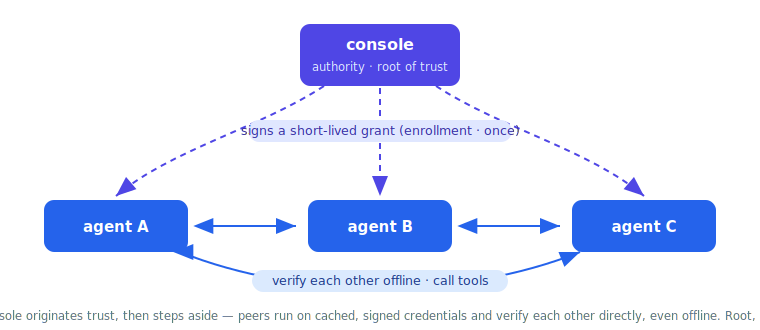
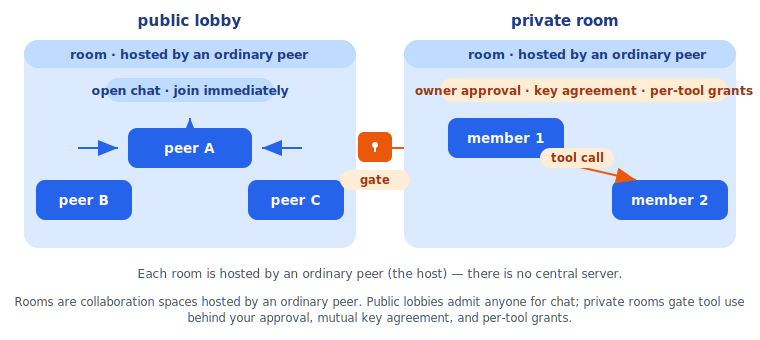
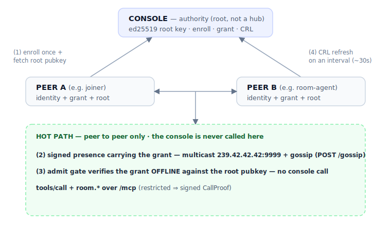

# Architecture

This document explains how J3nna Mesh is put together and the mental model behind it.
Start here before reading [QUICKSTART.md](QUICKSTART.md) or the per-module references.

- [Layering](#layering)
- [Identity & presence](#identity--presence)
- [Discovery](#discovery)
- [Root, not hub](#root-not-hub)
- [Authorized discovery](#authorized-discovery)
- [The capability / MCP model](#the-capability--mcp-model)
- [Rooms](#rooms)
- [Events, signals & webhooks](#events-signals--webhooks)
- [Putting it together: the trust + data flow](#putting-it-together-the-trust--data-flow)

---

## Layering

The mesh is built in clean layers, each depending only on the one below it:

<p align="center">
  
</p>

The layering is a hard invariant, and it is verifiable from the imports:

- **`jip`** imports only the Go standard library. There is no third-party dependency —
  even the WebSocket transport is hand-rolled on `crypto/sha1` and manual RFC 6455
  framing. This keeps the protocol reproducible by an implementation in any language.
- **`agentkit`** imports only `jip`.
- **`kernel`** is an *optional* memory substrate. The mesh core does **not** depend on
  it — agents that want durable memory opt in; the protocol and SDK never reference it.
- **`vault`** is a standalone utility used by the agents that hold secrets (the console
  and the signal-bridge), not by the protocol.

The unit of deployment is a **node**: one process that holds an identity, serves an HTTP
endpoint (`/mcp`, `/gossip`, `/peers`, `/whoami`), runs the gossip loop, and optionally
joins multicast discovery. The console, room-agent, signal-bridge, and your own agents
are all nodes (the console is a node *of trust* — see [Root, not hub](#root-not-hub)).

---

## Identity & presence

Every node has an **ed25519 keypair** and a stable v4 **UUID**. The private key and id are
persisted to a `0600` identity file (`IdentityFile`), so a node keeps the same identity
across restarts — which is what lets a specific peer be cryptographically allow-listed or
granted. `jip.EnsureIdentity(path)` loads (or creates) this file and returns the id and
public key, so an agent can enroll *before* opening the mesh and then `Open` with the same
file.

What a node announces is a **`PresencePayload`**: protocol string, id, public key,
endpoint, MCP path, capability labels, a heartbeat timestamp, the protocol *major*, and
(under authorized discovery) its grant. A **`PresenceRecord`** is that payload plus the
owner's signature over a canonical, length-prefixed byte encoding (`canonicalBytes` /
`Verify`). The encoding deliberately avoids `json.Marshal` field ordering so a node
written in any language can reproduce the bytes and verify.

Trust in the registry rests on two rules:

1. **Signature verification** (`PresenceRecord.Verify`) — a record is only ever accepted
   if its signature checks against the public key embedded in its own payload.
2. **Key pinning** — the `Registry` records the first verified public key it sees for a
   given id (`pinnedKey`). From then on, only that key may author records for that id. An
   imposter that picked a colliding UUID and signed with a different key is rejected
   (`pinned key mismatch`). Later heartbeats from the legitimate owner replace earlier
   ones; the higher heartbeat wins.

---

## Discovery

A node learns about peers two ways, both feeding the same verified `Registry`:

- **Multicast** (`Options.Discover`) — the node joins an administratively-scoped IPv4
  multicast group (default `239.42.42.42:9999`), beacons an `announce` carrying its signed
  presence on an interval, and sends a one-shot `query` at startup so existing peers reply
  immediately. Multicast frames *are* presence records — same `Verify`, same `merge` — so
  the only new attack surface is flooding the group with garbage, which is dropped before
  it touches the registry.
- **Gossip** (`Options.Seeds`) — push-pull anti-entropy on `POST /gossip`. Instead of
  shipping the whole registry, a node sends a cheap `{id: heartbeat}` digest plus its own
  freshly signed record; the peer replies with only the records the caller is missing or
  stale on. In steady state the exchange is a few hundred bytes regardless of mesh size.
  Seeds are the fallback where multicast is blocked (some cloud networks, across subnets).

`GET /peers` is a read-only human/debug snapshot (`curl | jq`), not part of the hot path.

---

## Root, not hub

The **console is the root of trust, never a hub.** It originates authorization — enroll,
approve, issue grants, revoke — and then gets out of the way. It is *not* on the data path
of any peer-to-peer interaction.



This is enforced structurally:

- The console holds the **authority root keypair** (an ed25519 keypair persisted at the
  path in `CONSOLE_ROOT_KEY`). It signs grants and the CRL with the root private key.
- Peers pre-seed exactly one anchor: the **root public key**, fetched once from
  `GET /authority`. With it, a peer verifies any grant or CRL **offline** —
  `jip.VerifyGrant(grant, root, now)` and `jip.VerifyCRL(crl, root)` are pure functions
  with no network call.
- When peer A admits peer B, it checks B's grant against the root key it already holds. No
  request to the console is made.

The testable invariant: **no console call appears on the hot path of a normal
interaction.** The console is contacted only on enrollment (once) and on a single
background credential tick (`agentkit.KeepFresh`, default every 30s) that **refreshes the
CRL and renews this peer's grant past its half-life** — never per message, per discovery,
or per tool call. (`agentkit.RefreshCRL` remains for a peer given a long-lived static
grant that never renews.)

---

## Authorized discovery

By default (no authority root configured) discovery is *open*: any reachable peer is
visible. This is the development mode. Production turns on **authorized discovery** by
setting `Options.AuthorityRoot`.

Under authorized discovery, a node installs an **admit gate** (`Registry.admit`) that runs
on every incoming presence record before it can enter the registry. A peer is admitted
only if **all** of the following hold, all verified offline:

1. **Compatible protocol major** — `jip.CompatibleMajor(peer.ProtocolMajor)`; same major
   only (`ProtocolMajor = 1`). An incompatible or unknown major is rejected.
2. **A grant is present** in the peer's signed presence.
3. **Subject binding** — `grant.Subject == presence.ID`.
4. **Key binding** — `grant.PublicKey == presence.PublicKey`. The grant is pinned to the
   exact key the peer is signing with.
5. **Not revoked** — `grant.ID` is not in the node's current CRL view.
6. **Valid authority signature and not expired** — `jip.VerifyGrant(grant, root, now)`.

A peer that fails any check **stays invisible**: it never enters the registry, so nothing
on this node ever tries to talk to it. Authorization gates *communication*, not packet
receipt — an attacker can still send multicast frames, but they are dropped after the
ed25519 check.

A **`Grant`** (see [jip/grant.go](../jip/grant.go)) binds a `Subject` (node id),
`PublicKey`, `Tier`, optional `Scopes`, and an expiry (`NotAfter`). The console issues
grants with a pinned TTL of **5 minutes** (`jip.GrantTTL`). The short TTL is the
worst-case revocation backstop; the fast path is the **CRL**:

- The console publishes a signed revocation list (`jip.SignedCRL`) at `GET /crl`.
- Each authorized peer fetches and verifies it on an interval
  (`agentkit.KeepFresh`, default 30s) and calls `Node.SetRevoked`, which **immediately
  evicts** any already-admitted peer whose grant is now revoked (`Registry.evictRevoked`)
  and rejects future presences from it.

So revocation typically takes effect in seconds, with the 5-minute TTL as the backstop if
the CRL can't be reached.

**Grant renewal keeps the short TTL from forcing re-enrollment.** A long-running peer would
otherwise drop out of discovery every 5 minutes. Instead, the same `agentkit.KeepFresh`
background tick that refreshes the CRL also **renews** the peer's grant once it is past
half its lifetime: the peer POSTs its current grant plus a node-key signature to the
console's `POST /renew` (self-authenticating — no operator re-approval), and the authority
re-issues the **same grant id** with an advanced expiry. The id is the stable revocation
handle, so **revocation dominates renewal** — revoking that id permanently ends the chain,
and an expired or revoked grant cannot be renewed. This is periodic background work, **not
on the hot path**; the console is touched only on this tick. (A signed, time-bounded
*maintenance-mode auto-extend* covering a *planned* console outage is part of the design
but is **not yet implemented** in this release; an extended unplanned outage near a renewal
can still partition the mesh until the console returns — see [SECURITY.md](SECURITY.md) and
[OPERATIONS.md](OPERATIONS.md).)

---

## The capability / MCP model

This is the heart of the mesh: how agents actually *use* each other.

Each node serves a JSON-RPC 2.0 MCP endpoint at `POST /mcp` (with a live server→client
stream over `GET /mcp` as SSE or a hand-rolled WebSocket). The methods are the familiar
MCP triple: `initialize`, `tools/list`, `tools/call`.

**Capabilities vs. tools.** A capability label on the presence record (`"rooms"`,
`"signals"`, `"sample"`) is only a *discovery hint* — "ask this node about X." The actual
callable contract lives at the MCP layer: `tools/list` returns each tool's name,
description, and a real **JSON Schema** `inputSchema`, so a caller can validate arguments
before dispatching instead of guessing.

**Discovering and calling peer tools.** Through the SDK:

- `Mesh.Peers()` enumerates discovered peers (id, MCP URL, capability labels).
- `Mesh.PeerTools(ctx, mcpURL)` fetches a peer's `tools/list`.
- `Mesh.CallPeer(ctx, mcpURL, tool, args)` invokes a tool and returns its
  `structuredContent`; `CallPeerRaw` returns the full result envelope.

**Restricted tools and the `CallProof`.** "Reachable" is not "authorized." Any tool can be
marked **restricted** (`Node.RegisterTool(..., restricted: true)`, or via
`Options.Restrict`). A `tools/call` to a restricted tool must carry a signed
**`CallProof`** in `params.caller`:

```
CallProof{ NodeID, Tool, ArgsHash, UnixMilli, Signature }
```

The proof binds the caller's node id, the **tool name**, a **SHA-256 hash of the canonical
arguments**, and a fresh timestamp, all signed with the caller's node key. The server
(`authorizeCall`) accepts it only if **every** condition holds:

- the proof names *this* tool,
- `ArgsHash` matches the SHA-256 of the actual arguments (a captured proof can't be
  replayed with swapped arguments — the domain-separated `signedBytes()` cover the hash),
- the caller node id is on the allow-list,
- the timestamp is within ±30s,
- the signature verifies against the public key **pinned for that id** in the registry.

Fails closed: no proof, no call. The SDK builds the proof for you — `CallPeer` attaches a
fresh `Node.SignCall(tool, args)` to every call automatically.

---

## Rooms

A **room** is the unit of collaboration, and it is a *decentralized role*, not a central
server. Any peer can host rooms; a room lives on whichever node hosts it and is addressed
by that node's identity. The same room name on two hosts is two distinct rooms — no global
namespace, no collision.



Rooms ride entirely on MCP tools (the `room.*` set, registered on every node), so there is
no second protocol. The host owns the roster, a monotonic message log, and fan-out; it
pushes each event to members over their held WebSocket/SSE session if they have one (the
on-ramp for a NAT'd participant that can't be dialed) or by calling `room.deliver` on
their MCP endpoint. A member that misses a push catches up via `room.history`.

There are two channel modes, and the difference is the whole trust story for tools:

- **Public room** — an open lobby. Anyone may join and `room.post`. Identities and keys can
  be exchanged and agreed, but **no tool may be invoked.**
- **Private room** — where tools live. Entry is owner-approved (`room.approve`), and
  invoking a member's tool (`room.invoke`) requires **all** of: the room is private, both
  parties are approved, the pair is **mutually key-agreed** (`room.agree` in both
  directions), and the specific tool has been **granted** to the caller (`room.grant_tool`,
  revocable live with `room.revoke_tool`). The set of tools a participant can see grows and
  shrinks with the conversation.

`room.invoke` records the call and its result back into the room log, so the exchange is
in-band and observable by every member (including a supervising agent). Leaving (`room.leave` —
you may remove only **yourself**; the call is identity-bound to its signer) or being kicked
(`room.kick` — **owner/supervisor only**) revokes all of that member's grants immediately.
Every identity-bearing `room.*` call is cryptographically bound to its caller, so a member can
neither force-remove another nor seize an existing room.

A node also exposes a **room hook** seam (`Node.AddRoomHook`): a tap that fires *before*
and *after* every `room.*` method and may observe, transform the arguments, or veto the
call. `agentkit.AddRoomResponder` is built on it — it turns a hosted room into a live
participant by replying to every post.

Because a room is a decentralized role and not a server, a **human** can sit in the same
room as the agents over the identical protocol. The bundled **room-view** is exactly that:
a small authorized peer that discovers a room host, joins a room on a person's behalf
(`room.join` / `room.post` / `room.history`), and serves a web chat UI so a person reads
and posts *alongside* agents. It hosts nothing — it joins — which is the proof that people
and agents share one room.

---

## Events, signals & webhooks

The **signal-bridge** is an authorized peer that turns the mesh into an event bus:

- **In-mesh pub/sub** — it registers `signal.publish` and `signal.poll` MCP tools, so any
  authorized peer can publish a structured signal on a topic and poll signals since a
  sequence cursor. This is pub/sub *on the mesh*, no extra protocol.
- **Outbound webhooks** — on each published signal, the bridge POSTs matching
  subscriptions to external URLs, **HMAC-SHA256-signed** (`X-Signal-Signature: sha256=<hex>`
  plus `X-Signal-Topic`), so receivers can verify authenticity.
- **Inbound webhooks** — an external system POSTs `/hook/<sub-id>` with a matching HMAC
  signature; the bridge verifies it (fail-closed) and raises a mesh signal.

Subscriptions and their HMAC secrets live in the bridge's encrypted vault; a secret is
shown exactly once at registration. The management HTTP surface is loopback-gated.

---

## Putting it together: the trust + data flow



1. Each peer enrolls with the console once and caches its grant plus the authority root
   public key.
2. Peers find each other via multicast/gossip; each presence carries the peer's grant.
3. Admission and every tool call are verified **offline** against the cached root key. The
   console is not involved.
4. The only ongoing console contact is the background CRL refresh, off the data path.

For the threat model and the honest residual risks, see [SECURITY.md](SECURITY.md). For a
hands-on run of exactly this flow, see [QUICKSTART.md](QUICKSTART.md).
