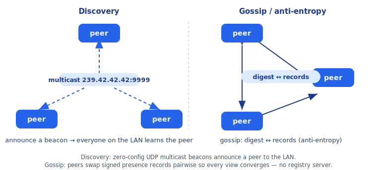

# JIP Wire Protocol — non-signed surfaces

This is the wire-format reference for the parts of JIP/0.1 that ride **standard
HTTP/JSON and UDP**: how a peer is discovered, how peers reconcile who-knows-whom,
the MCP request/response envelopes, and the console enrollment flow.

It is the companion to two other documents — read them alongside this one:

- The **signed-bytes framing** (how a `PresenceRecord`, `Grant`, and `CallProof`
  are turned into the exact bytes that get ed25519-signed) is specified, with
  cross-language test vectors, in [`../../jip/conformance/README.md`](../../jip/conformance/README.md).
  This document shows where those signed structures travel on the wire (their JSON
  field names), but **never** re-specifies how their signatures are built — that
  is the conformance contract's job.
- The **full endpoint and tool catalog** — every console route, the room-view and
  signal-bridge HTTP APIs, and the `room.*` / `signal.*` tool tables — lives in
  [API.md](API.md). This document is the wire-format reference *for the four
  surfaces below*; where API.md already enumerates an endpoint table or a tool
  list, this document links to it rather than duplicating it.

The protocol identifier is `JIP/0.1` (`jip.ProtocolVersion`). The **enforced**
compatibility integer is the protocol **major** `jip.ProtocolMajor = 1`, carried
in presence as `protocol_major`; peers reject an incompatible major fail-closed.
See [VERSIONING.md](VERSIONING.md).

Throughout, **every `PresenceRecord`, `Grant`, and `CallProof` that appears below
is independently verified by the receiver against its embedded signature** — the
UDP source address, the HTTP peer address, and any unsigned envelope field are
never trusted for identity or authorization. Identity comes from the signature
inside the structure, nothing outside it.

---

## 1. Discovery — UDP multicast

Zero-config peer discovery rides IPv4 multicast. Every node joins a well-known
multicast group and periodically broadcasts its own signed presence; newcomers
learn the mesh just by listening. `-seed`/`Seeds` (unicast bootstrap, see §2)
remains the fallback where multicast is unavailable.



| Property | Value |
| --- | --- |
| Multicast group (default) | `239.42.42.42:9999` (`Options.MulticastGroup`) — IPv4 administratively-scoped, link/site-local, never routed across the internet |
| Transport | UDP datagrams, one frame per datagram |
| Max frame | 8 KiB (`beaconMaxFrame`); JIP never fragments on purpose (a typical record is ~300 B) |
| ANNOUNCE cadence (default) | 5 s (`Options.BeaconEvery`) |

The group must be a multicast address (validated at startup); a non-multicast
group is a configuration error.

### The beacon frame

One UDP datagram carries one JSON `beaconFrame`:

```json
{
  "kind": "announce",
  "record": { "...a signed PresenceRecord (see below)..." }
}
```

- **`kind`** is one of `"announce"` or `"query"`.
- **`record`** is **always the sender's own signed `PresenceRecord`** — even on a
  query, so a listener immediately learns the querier.

The embedded `record` is the same `PresenceRecord` that flows over gossip (§2):
a `payload` plus the node's ed25519 `signature` over its canonical bytes. The
payload's JSON shape:

```json
{
  "payload": {
    "protocol": "JIP/0.1",
    "id": "<node uuid>",
    "public_key": "<base64 ed25519, 32 bytes>",
    "endpoint": "http://10.0.0.5:9000",
    "mcp_path": "/mcp",
    "capabilities": ["echo", "clock"],
    "heartbeat_unix": 1717329600,
    "protocol_major": 1,
    "grant": { "...optional authority-signed Grant..." }
  },
  "signature": "<base64 ed25519 over the payload's canonical bytes>"
}
```

`grant` and `protocol_major` are the authorized-discovery fields; both are
covered by the presence signature. (`alg` may appear for crypto agility; empty
means ed25519.) The exact byte framing the `signature` covers — field order,
length-prefixing, capability sorting — is the **presence record** structure in
[the conformance contract](../../jip/conformance/README.md#1-presence-record--signed-by-the-peers-node-key).
A frame is verified before it is allowed to touch the registry; unverifiable
frames are dropped.

### How a peer announces and learns peers

1. **On startup** a node sends one `announce` *and* one `query` immediately, so it
   both makes itself known and provokes others to respond without waiting a full
   beacon interval.
2. **Every beacon interval** (default 5 s) it re-broadcasts an `announce` to the
   group, refreshing its `heartbeat_unix` so peers don't expire it.
3. **On hearing a frame**, a listener verifies the embedded record, ignores it if
   it is its own (multicast loopback echoes a node's own announces back), and
   merges it into the registry.
4. **On hearing a `query`**, a peer re-broadcasts an `announce` **to the group**
   (not a unicast reply to the querier) so the newcomer converges quickly. The
   QUERY is the trigger; the response is an ordinary group ANNOUNCE.

> The same `Verify` + `merge` path handles a beacon frame and a gossip body
> identically, so a presence record is interchangeable between the two transports.

---

## 2. Gossip / anti-entropy — `POST /gossip`

Multicast bootstraps discovery on a LAN; **gossip** is the reconciliation layer
that keeps every peer's registry converged (and works across subnets where
multicast does not). It is a push-pull anti-entropy exchange over HTTP.

| Property | Value |
| --- | --- |
| Endpoint | `POST /gossip` (request and response use the same envelope) |
| Content type | `application/json` |
| Body cap | 1 MiB (`io.LimitReader`) each direction |
| Tick interval (default) | 3 s (`Options.Interval`); each tick a node refreshes its own record, expires stale peers, and exchanges with one random peer |
| Peer TTL (default) | 30 s (`Options.TTL`) — a record not refreshed within the TTL is expired |
| Companion route | `GET /peers` — a read-only **full snapshot** of the registry for humans (`curl | jq`), not the hot path |

### The envelope

Both directions send the **same** struct; only the meaning of `records` differs:

```json
{
  "protocol": "JIP/0.1",
  "digest":  { "<node-id>": 1717329600, "<node-id>": 1717329611 },
  "records": [ { "...PresenceRecord..." } ]
}
```

- **`protocol`** — the sender's JIP version.
- **`digest`** — a cheap `{ node-id: heartbeat_unix }` map of *everything the
  sender already holds*. This is what makes the exchange anti-entropy rather than
  a full O(N) dump: the responder uses it to compute the delta.
- **`records`** — pushed presence records. **The semantics are asymmetric:**
  - **Requester → responder:** the requester pushes its `digest` plus **only its
    own freshly-signed self-record** in `records`.
  - **Responder → requester:** the responder merges what was pushed, then replies
    with its own `digest` plus, in `records`, **only the delta** — the records the
    requester's digest shows it is missing or holds a staler `heartbeat_unix` for.

### How the digest drives the exchange

The requester says "here is everything I know (digest) and here is my own current
record." The responder replies with exactly the records the requester lacks or is
stale on — nothing more. In steady state both digests match, the delta is empty,
and an exchange is a few hundred bytes regardless of mesh size. A new or restarted
node has an empty digest, so the responder sends it everything and it converges in
one round. Every pushed and returned record is `Verify`-checked before it is
merged; a bad signature is rejected, not registered.

A complete exchange (requester's view):

```
requester  --POST /gossip-->  responder
  { protocol, digest: {all I know}, records: [my own self-record] }

requester  <----200---------  responder
  { protocol, digest: {all responder knows}, records: [delta I was missing] }
```

---

## 3. MCP surface — JSON-RPC 2.0 over `POST /mcp`

Each peer exposes one JSON-RPC 2.0 endpoint (default path `/mcp`) over which it
advertises and serves **tools**. Discovery answers *who exists and what they
advertise* (presence capabilities are routing hints only); the **callable
contract** — argument schema, result shape, whether a signed proof is required —
lives here and is served by `tools/list`.

`POST <peer>/mcp` carries one JSON-RPC request and returns one response
(`Content-Type: application/json`). The same dispatch backs the real-time
transports (`GET /mcp` upgraded to WebSocket, or SSE); see [API.md §3.1](API.md#31-transport--json-rpc-20-envelope).

### Request envelope

```json
{ "jsonrpc": "2.0", "id": 1, "method": "<method>", "params": { } }
```

Methods: `initialize`, `notifications/initialized`, `ping`, `tools/list`,
`tools/call`. The MCP `protocolVersion` reported by `initialize` is
`"2025-06-18"`; `serverInfo.jipProtocol` is the cosmetic `"JIP/0.1"`. (Do not
conflate either with the enforced wire-protocol major `1`.)

### `tools/list`

```json
{ "jsonrpc": "2.0", "id": 1, "method": "tools/list" }
```

Returns every tool the peer serves, **sorted by name**. Each descriptor carries
its real JSON Schema and an `annotations.restricted` hint telling a mesh-aware
caller whether a signed proof is needed:

```json
{ "jsonrpc": "2.0", "id": 1, "result": { "tools": [
  {
    "name": "echo",
    "description": "Echo a message back to the caller.",
    "inputSchema": {
      "type": "object",
      "properties": { "message": { "type": "string", "description": "Text to echo back" } },
      "required": ["message"],
      "additionalProperties": false
    },
    "annotations": { "restricted": false }
  }
] } }
```

(The full `room.*` and `signal.*` tool catalog is in [API.md §3.5–3.6](API.md#35-signal-bridge-mesh-tools).)

### `tools/call`

```json
{ "jsonrpc": "2.0", "id": 1, "method": "tools/call", "params": {
  "name": "<tool name>",
  "arguments": { },
  "caller":    { "...optional CallProof..." },
  "presenter": { "...optional PresenceRecord..." },
  "trace":     "00-<traceid>-<spanid>-01"
} }
```

The `params` fields:

- **`name`** — the tool to invoke. An unknown name returns a JSON-RPC `-32601`
  error (see below).
- **`arguments`** — the argument object, validated by the tool's `inputSchema`.
- **`caller`** — an **optional signed `CallProof`** (JSON shape below). Required
  for a tool whose `annotations.restricted` is `true`, and for identity-bound
  `room.*` tools; the server verifies it against the caller's pinned public key.
  How its signed bytes are built is the **CallProof** structure in
  [the conformance contract](../../jip/conformance/README.md#3-callproof--signed-by-the-callers-node-key).
- **`presenter`** — an **optional signed `PresenceRecord`**, used on **first
  contact**: a caller a host has never met presents its own signed presence so the
  host can admit it (subject to the discovery admit policy) and then resolve and
  verify the `caller` proof's key. Same record shape as §1. Idempotent on repeat.
- **`trace`** — **the one UNSIGNED field.** A W3C `traceparent` propagated across
  hops for observability only. It is *not* part of any signed bytes and MUST NOT
  affect proof verification. If absent, the server mints a fresh one.

The `CallProof` wire shape carried in `caller`:

```json
{
  "node_id":    "<caller node uuid>",
  "tool":       "<tool name>",
  "args_hash":  "<base64 sha256 of the canonical arguments>",
  "unix_milli": 1717329600123,
  "signature":  "<base64 ed25519 over the proof's signed bytes>"
}
```

(`alg` may appear for crypto agility; empty means ed25519. The `args_hash`
canonicalization is the single cross-language gotcha and is pinned, with vectors,
in [the conformance contract](../../jip/conformance/README.md#the-three-signed-structures-a-peer-needs).)

### Result shape — and the error/`isError` distinction

This is the part most clients get wrong, so it is explicit here. There are **two
separate failure channels**:

**1. Protocol-level errors use the JSON-RPC `error` field** (HTTP request still
returns, with an `error` object, no `result`):

```json
{ "jsonrpc": "2.0", "id": 1, "error": { "code": -32601, "message": "unknown tool: …" } }
```

Codes in use: `-32700` parse error, `-32600` invalid request (missing or
non-`"2.0"` `jsonrpc`), `-32601` method-not-found / unknown tool, `-32602` invalid
params. An **unknown tool name** is a `-32601` error here.

**2. A tool that *ran* (or was denied/failed) returns a normal `result` with
`isError` — NOT a JSON-RPC `error`.** Once the method and tool resolve, the call
always produces a `result`:

Success:
```json
{ "jsonrpc": "2.0", "id": 1, "result": {
  "content":           [ { "type": "text", "text": "<short summary>" } ],
  "structuredContent": { "...the structured result object..." }
} }
```

Tool error, authorization denial, or identity-binding failure:
```json
{ "jsonrpc": "2.0", "id": 1, "result": {
  "isError": true,
  "content": [ { "type": "text", "text": "access denied: …" } ]
} }
```

The result fields:

- **`content`** — an array of content blocks; JIP emits one `{"type":"text","text":…}`
  block (a short human summary, or the error message when `isError` is set).
- **`structuredContent`** — the structured result object (present on success;
  this is what a programmatic caller reads).
- **`isError`** — `true` when the tool handler returned an error or the call was
  denied (restricted-tool authorization or identity binding). Its absence (or
  `false`) means success.

> Rule of thumb: a **bad request** (parse / invalid / unknown method / unknown
> tool) surfaces in `error`; a **bad outcome** of a real tool (denied, failed)
> surfaces in `result.isError`. A caller must check both.

---

## 4. Enrollment flow — console HTTP

Enrollment is the single ingress for an untrusted client to obtain a credential.
A requester submits a request, the operator confirms an out-of-band (OOB) code in
the console and approves, and the requester polls for its credential. A **user**
receives a bearer token; an **agent** receives an authority-signed `Grant` bound
to its node id and public key. The console is the root of trust and is **never on
the hot path** of a peer-to-peer call. Default bind: `127.0.0.1:8455`
(`CONSOLE_ADDR`). The full route table and auth model are in
[API.md §1](API.md#1-console-http-api); this section is the wire walk-through.

### Step 0 — `GET /authority` (public)

A requester first fetches the **authority root public key**, which it pre-seeds so
it can later verify every grant and the CRL **offline** against it.

```json
{
  "root_public_key": "<base64 ed25519, 32 bytes>",
  "protocol_major": 1,
  "version": "0.1.0"
}
```

### Step 1 — `POST /enroll` (open ingress)

The requester registers. `kind` is `"user"` or `"agent"`:

```json
{
  "kind":        "agent",
  "client_name": "room-agent",
  "email":       "optional — a human-readable LABEL only (users)",
  "subject":     "<agent node id>     (agent enroll)",
  "public_key":  "<base64 ed25519, 32 bytes> (agent enroll)",
  "tier":        3
}
```

For `kind:"agent"`, `public_key` **must** decode to a 32-byte key (else `400`);
the grant the console later issues is bound to this `subject` + `public_key`. The
response returns the polling capability and the OOB code to display:

```json
{ "request_id": "<32-byte unguessable hex>", "oob": "123-456", "status": "pending" }
```

The `request_id` is an unguessable bearer capability: holding it is what permits
polling in step 3. The `oob` is shown to the operator out-of-band for matching.

### Step 2 — operator approval: `POST /enroll/<request_id>/approve`

The operator, having confirmed the requester is displaying the same OOB code,
approves (this route is management-gated — see API.md). The body echoes the code:

```json
{ "oob": "123-456" }
```

Response `{"status":"approved"}` on a match; an OOB mismatch returns `400`. On
approval the console mints the credential and attaches it to the stored request:
a **user** gets a bearer `token`; an **agent** gets an authority-signed `grant`.
(A sibling `POST /enroll/<request_id>/deny` sets the request to denied.)

### Step 3 — requester polls: `GET /enroll/<request_id>` (open)

The requester polls by holding the `request_id`. Before approval the record shows
`"status":"pending"`. Once approved, the response carries the credential — a
`token` for a user, the **full `grant` object** (including its `id`) for an agent:

```json
{
  "id":     "<request_id>",
  "kind":   "agent",
  "status": "approved",
  "grant": {
    "id":         "<grant_id>",
    "subject":    "<agent node id>",
    "public_key": "<base64>",
    "tier":       3,
    "issued_at":  1717329600,
    "not_after":  1717329900,
    "signature":  "<base64 ed25519 by the authority root>"
  }
}
```

The agent then carries this `grant` in its presence (§1) and verifies it offline
against the `root_public_key` from step 0. The grant's `signature` byte framing is
the **grant** structure in
[the conformance contract](../../jip/conformance/README.md#2-grant--signed-by-the-authority-root-key);
this flow only transports it as JSON. The returned `grant.id` is the stable handle
for later revocation (`DELETE /grants/<grant_id>`, see API.md).

### The flow at a glance

```
requester                         console (root of trust)         operator
   |--- GET  /authority --------------->|                            |
   |<-- root_public_key ----------------|                            |
   |--- POST /enroll ------------------>|                            |
   |<-- {request_id, oob, pending} -----|                            |
   |   (display OOB) ............................................. (sees OOB)
   |                                    |<-- POST /enroll/<id>/approve {oob}
   |                                    |--- {status: approved} ---->|
   |--- GET /enroll/<id> (poll) ------->|                            |
   |<-- {status: approved, grant|token}-|                            |
```

---

## See also

- [`../../jip/conformance/README.md`](../../jip/conformance/README.md) — the
  signed-bytes framing for `PresenceRecord`, `Grant`, and `CallProof`, with
  cross-language test vectors. The authority on how every signature in this
  document is built.
- [API.md](API.md) — the complete console / signal-bridge / room-view endpoint
  tables and the full `room.*` / `signal.*` tool catalog.
- [VERSIONING.md](VERSIONING.md) — protocol-major enforcement and module
  versioning.
- [SECURITY.md](SECURITY.md) — the trust model and residual risks.
