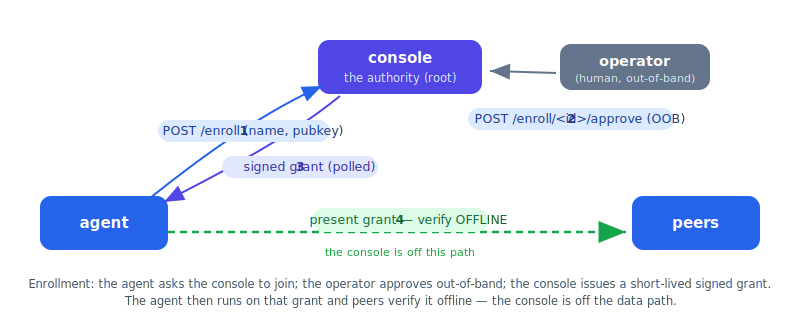

# Quickstart

This is the full **authorized loop**, end to end, in about ten minutes: a control-plane
console, a room-host agent, and a sample agent that enrolls, discovers the room host,
joins its room, posts, and reads — every step authorized, with the console never on the
data path.



You will run four processes (one per terminal) and approve two enrollments. Everything
runs on loopback with plain HTTP.

> **Prerequisites:** Go 1.26.3+ (latest stable) and a checkout of the repo. All commands are run from the
> repository root (where `go.work` lives). See [INSTALL.md](INSTALL.md) for details.

---

## 0. (Optional) Build the binaries

You can `go run` each component directly (the commands below do), or build them once:

```sh
go build -o bin/console        ./console
go build -o bin/room-agent     ./room-agent
go build -o bin/signal-bridge  ./signal-bridge
go build -o bin/room-view      ./room-view
go build -o bin/joiner         ./samples/joiner
```

---

## 1. Run the console (the authority)

The console holds the authority root keypair and the user/secret vault. Provide a vault
master secret so user management is enabled — the simplest is a passphrase:

```sh
CONSOLE_VAULT_PASSPHRASE='change-me' go run ./console
```

Expected output:

```
console 0.1.0 listening on 127.0.0.1:8455 (vault=console-vault.enc, locked=false)
```

What just happened, in files next to where you ran it:

- `console-root.key` — the authority root **keypair** (generated on first run, `0600`).
  `CONSOLE_ROOT_KEY` is the *path* to this file, not the key material.
- `console-vault.enc` — the encrypted vault, unlocked by your passphrase.
- `console-crl.json` — the (initially empty) revocation list. `CONSOLE_CRL` is its path.

> If you see `vault LOCKED`, no master secret was supplied — set
> `CONSOLE_VAULT_PASSPHRASE` (or `CONSOLE_VAULT_KEY` / `CONSOLE_VAULT_KEYFILE`) and
> restart. See [CONFIGURATION.md](CONFIGURATION.md).

Sanity-check it:

```sh
curl -s http://127.0.0.1:8455/healthz        # 200, empty body
curl -s http://127.0.0.1:8455/authority      # {"root_public_key":"...","protocol_major":1,"version":"0.1.0"}
```

---

## 2. Run a room-agent (self-enrolls with the console)

In a second terminal, point a room-agent at the console. It generates its identity,
enrolls, and **blocks waiting for approval**, printing an out-of-band (OOB) code:

```sh
ROOM_AGENT_CONSOLE='http://127.0.0.1:8455' go run ./room-agent
```

Expected output (it pauses here until you approve in step 3):

```
room-agent: APPROVE this enrollment in the console — out-of-band code 481-205
```

(Your code will differ — it's a random `NNN-NNN`.) The agent will host the room `lobby`
on mesh address `8482` once approved.

---

## 3. Approve the room-agent's enrollment

This release ships the console as an **HTTP API** — there is no separate UI. The operator
approves from a loopback shell, which the console trusts as a manager.

First list the pending requests to get the request **id** (the agent printed only the OOB):

```sh
curl -s http://127.0.0.1:8455/enroll/pending
```

```json
{"pending":[{"id":"a1b2c3…","kind":"agent","client_name":"room-agent","oob":"481-205",
             "tier":3,"created_at":1730000000,"status":"pending"}]}
```

Match the `oob` to the code the room-agent printed, then approve using that request id —
the OOB in the body **must match**, or the console rejects it:

```sh
curl -s -X POST http://127.0.0.1:8455/enroll/<id>/approve -d '{"oob":"481-205"}'
# {"status":"approved"}
```

Back in the room-agent terminal, it unblocks and comes up:

```
room-agent: enrolled — grant 7f3a9c1d…
room-agent up: id=<uuid> hosting #lobby at http://127.0.0.1:8482/mcp (authz=true)
```

`authz=true` confirms it is running under authorized discovery: it presents its own grant
and will admit only granted peers.

---

## 4. Run the sample joiner (enroll → discover → join → post → read)

In a third terminal:

```sh
SAMPLE_CONSOLE='http://127.0.0.1:8455' go run ./samples/joiner
```

It enrolls and blocks for approval, just like the room-agent:

```
joiner: enrolling with console http://127.0.0.1:8455 …
joiner: APPROVE this enrollment in the console — out-of-band code 902-117
```

Approve it the same way as step 3 (list pending, match the OOB, approve):

```sh
curl -s http://127.0.0.1:8455/enroll/pending
curl -s -X POST http://127.0.0.1:8455/enroll/<id>/approve -d '{"oob":"902-117"}'
```

Now the joiner runs the whole loop on its own. It opens the mesh authorized, **discovers**
the room-agent by its `rooms` capability (it is never hardcoded — discovery happens over
multicast/gossip, which can take a few seconds), joins `lobby`, posts, and reads back the
history:

```
joiner: enrolled — grant b4e8a9c1…
joiner: discovered room agent at http://127.0.0.1:8482/mcp — joining #lobby
joiner: #lobby has N message(s):
joiner:   <8-char-id>: hello from sample-joiner — authorized and present.
joiner: collaboration loop complete — staying on the mesh (Ctrl-C to exit)
```

The `room.history` read-back above is the proof the post arrived: the joiner posted to the
room hosted on the room-agent, then read the room's log back over the mesh and saw its own
message. (The room-agent's host does not dial *itself* or the originating sender, so this
post does not produce a separate delivery line in the room-agent's terminal — the room log
is the source of truth, and the joiner's history read confirms it.)

You've completed the authorized loop: two agents that never knew each other's addresses in
advance found each other on the mesh, proved their authorization to each other **offline**,
and collaborated in a room — with the console only ever touched for enrollment.

> **Note on longevity.** Grants have a short fixed 5-minute TTL (`jip.GrantTTL`), but the
> bundled agents **renew automatically**: they run `agentkit.KeepFresh`, which renews each
> grant past its half-life on the same background tick as the CRL refresh — so these peers
> **stay on the mesh indefinitely** while the console is reachable, with no re-enrollment
> and the console never on the hot path. (An extended *unplanned* console outage near a
> renewal can still partition the mesh until the console returns — and a planned
> maintenance-mode auto-extend is designed but not yet implemented.) See
> [SECURITY.md](SECURITY.md) and [OPERATIONS.md](OPERATIONS.md).

---

## Prove that unauthorized peers are invisible

This is the point of authorized discovery, and it's worth seeing for yourself. Start a
peer with **no grant** — for example, run the joiner without enrolling, or any node with
`Discover: true` but no `AuthorityRoot`/`Grant`. It will beacon on the same multicast
group, but the room-agent's admit gate rejects its presence (no valid grant), so the peer
never enters the room-agent's registry. Nothing on the room-agent tries to talk to it — it
is simply not there as far as the authorized mesh is concerned. In the room-agent's logs
you'll see the discovery frame rejected rather than accepted.

---

## (Optional) Add the events / webhooks bridge

In a fourth terminal, enroll a signal-bridge the same way:

```sh
SIGNAL_CONSOLE='http://127.0.0.1:8455' go run ./signal-bridge
# approve its enrollment as in step 3
```

It joins the mesh advertising the `signals` capability and serves a loopback-gated
management HTTP API on `127.0.0.1:8484` for registering outbound webhooks (the HMAC
secret is shown once) and accepting inbound ones. Any authorized peer can then publish and
poll signals via its `signal.publish` / `signal.poll` MCP tools. See
[ARCHITECTURE.md#events-signals--webhooks](ARCHITECTURE.md#events-signals--webhooks).

---

## (Optional) Add a human to the same room

A person can sit in the exact room the agents are in, over the same protocol. Enroll a
room-view the same way (it joins; it hosts nothing):

```sh
ROOMVIEW_CONSOLE='http://127.0.0.1:8455' go run ./room-view
# approve its enrollment as in step 3 (the pending client_name is "room-view")
```

Once approved it discovers the room-agent by its `rooms` capability, joins `lobby` as
`guest` (set `ROOMVIEW_NAME` to change the alias), and serves a web chat UI. Open it and
read/post alongside the agents:

```
http://127.0.0.1:8487
```

The joiner's messages appear there, and anything you post lands in the same room log the
agents read. See [room-view/README.md](../room-view/README.md).

---

## What to read next

- [ARCHITECTURE.md](ARCHITECTURE.md) — the trust model, the capability/MCP model, and rooms.
- [CONFIGURATION.md](CONFIGURATION.md) — every environment variable and default port.
- [SECURITY.md](SECURITY.md) — the threat model and the honest residual risks.
- [OPERATIONS.md](OPERATIONS.md) — enrolling, revoking, and day-two operations.
- [samples/README.md](../samples/README.md) — the reference agent's source,
  the template for writing your own.
