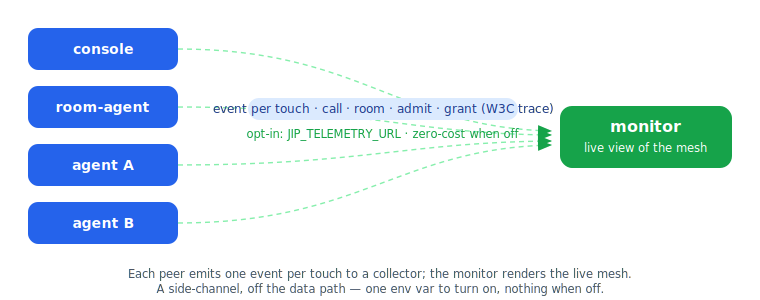

# Telemetry

J3nna Mesh has **full, first-class telemetry built in** — every operation through the mesh ("every touch")
can be observed: tool calls, room activity, peer admissions and rejections, grant issuance. It is **opt-in
and zero-cost when off**, has **no dependencies**, and is the seam an advanced build (e.g. J3nna Fabric)
extends for retention, OTLP export, accounting, and dashboards.



This page is both the user guide and the **seam contract**: implement the one interface and you receive
every event the mesh emits.

## Turn it on in 10 seconds

Point any peer at a collector with one environment variable, then run the bundled monitor:

```sh
go run ./monitor                                                # live view, collector on :19000
JIP_TELEMETRY_URL=http://127.0.0.1:19000/events go run ./room-agent
JIP_TELEMETRY_URL=http://127.0.0.1:19000/events go run ./samples/joiner
```

The monitor renders a live terminal dashboard — a roster of who's present above a scrolling, color-coded
stream of every touch. With no `JIP_TELEMETRY_URL` and no `Observer` set, the mesh does nothing extra.

## The event model

Every touch is one `jip.Event` (see [`jip/observer.go`](../jip/observer.go)):

| Field | Meaning |
| --- | --- |
| `ts` | unix milliseconds |
| `node` | the node whose activity this is |
| `kind` | `call` · `admit` · `reject` · `room` · `gossip` · `grant` · `presence` |
| `peer` | the other party, if any |
| `tool` | tool name, for calls |
| `room` | room id, for room activity |
| `outcome` | `ok` · `denied` · `error` |
| `detail` | short human context (e.g. a rejection reason) |
| `trace` | W3C `traceparent`, propagated across hops (see below) |
| `span` | this operation's span id |
| `dur_ms` | duration, where meaningful |

Emit points are **at the operation boundaries inside the core**, so they see what a wrapper can't — e.g. an
authorization *verdict* (`denied`) versus a tool error versus success. Presence and gossip are
**edge-triggered** (a peer admitted/rejected/expired, an exchange that actually changed state) — never per
heartbeat — so the signal isn't drowned by routine churn.

## The contract: implement `Observer`

```go
type Observer interface {
    Observe(Event) // MUST be non-blocking and concurrency-safe; the mesh never blocks on telemetry
}
```

Set it via `agentkit.Options.Observer` (or `jip.Options.Observer` for a raw node). The mesh calls
`Observe` for every event; a slow or dead observer must **drop**, never stall an operation. The reference
`jip.NewHTTPObserver(url)` does exactly this — events queue on a bounded channel shipped by a background
goroutine and are dropped if it backs up.

**This is where Fabric plugs in.** A custom `Observer` can fan events to OTLP/OpenTelemetry, persist them,
meter and bill them, or drive a UI — all without forking the core. OSS ships the seam and a reference HTTP
emitter + CLI monitor; the advanced tooling layers on top.

## Distributed tracing (W3C Trace Context)

`trace` carries a [W3C `traceparent`](https://www.w3.org/TR/trace-context/) so a multi-hop operation
(peer A calls B, B calls C) stitches into one trace in any OpenTelemetry-compatible backend. A `tools/call`
may carry an optional `trace` field in its params; the server stamps it on the emitted `call` event, or
mints a fresh `traceparent` if absent so **every** call is traceable.

`trace` is **unsigned** — it is observability metadata, never authorization. It is *not* part of the
`CallProof` signed bytes, so it cannot weaken proof verification or replay protection. Operations are
already individually signed (presence, grant, `CallProof`), which provides non-repudiable "who did what";
the trace field correlates them into chains. (If a deployment ever needs the causation chain itself to be
tamper-evident, that is an additive optional signed `caused_by` extension — not a core change.)

## What's emitted

- The seam (`Observer`, `Event`, `emit`), the reference HTTP emitter, and the live CLI monitor.
- Emit at every peer boundary: `EvCall`, `EvAdmit`/`EvReject` (edge-triggered), `EvRoom`.
- `EvGrant` from the console on issuance.
- The unsigned `trace` field on `tools/call`, stamped/minted per call.
- **Caller-side propagation** — an SDK attaches one `traceparent` across a logical operation's calls, so a
  whole join→post→history flow is one trace in the monitor.
- **Server-side fan-out** — a host's deliveries inherit the inbound trace: a `room.post`'s N `room.deliver`
  calls carry the post's trace, so they appear as part of the post in the monitor rather than as orphaned
  spans.
