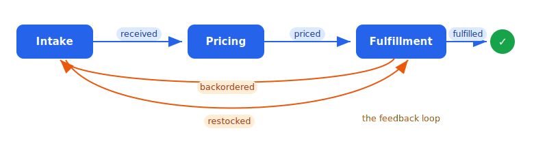

# Order Fulfillment — an advanced multi-agent example

Three autonomous agents run a real order-fulfillment workflow over the mesh. There is **no LLM and no
randomness** — every run is deterministic — yet the agents interact in a genuinely complex, non-linear way:
they enrich and evolve a **shared knowledge graph** (the J3nna **kernel**), they sign shipment
authorizations through the encrypted **vault**, they coordinate purely through **events** (no agent calls
another directly), and a scarcity in the data forces a **feedback loop** — a backorder that ripples back to
the supplier and returns as a retry. The whole thing is observable in the **telemetry monitor**, and every
peer waits for its dependencies to be *operational* before it starts talking.

It's a worked example of the mesh's pieces fitting together: identity + grants, discovery, rooms, the kernel,
the vault, telemetry. Nothing here is core mesh surface — it all lives in this directory.

---

## The story

A warehouse takes orders. Each order is priced (with a per-customer discount), then fulfilled from stock.
But one item — `gadget` — is **deliberately scarce**: total demand is 9 units, initial stock is 5. So
fulfillment *will* run short, an order *will* backorder, and that is where the example gets interesting.

### The cast (every one a mesh peer)

| Peer | Role |
| --- | --- |
| **console** | the authority — issues the signed grants that let peers onto the mesh. |
| **room-agent** | hosts the `ops` room, used here as an **event bus**. |
| **kernel-service** | the **shared memory** — a J3nna kernel graph of orders, items, customers, inventory, allocations and shipments, with the edges between them. Preloads its master data (inventory + customers) from [`inventory.jsonl`](inventory.jsonl) on startup, and serves `mem.*` tools (`put`/`get`/`query`/`link`/`neighbors`/**`allocate`**/`restock`). `allocate` is an *atomic* check-then-decrement, which is what stops two agents overselling the last unit. |
| **vault-service** | the **secrets** — embeds the encrypted vault, holds the carrier signing key, and exposes one tool, `secret.sign`. It signs a shipment authorization **by handle** and returns only the signature; the key is decrypted in-process and **never crosses the mesh**. |
| **intake** · **pricing** · **fulfillment** | the three agents (Python SDK), below. |

### The flow (a choreography, not a pipeline)

Agents never call each other. They react to events on the `ops` room and read/write the shared kernel:

1. **Intake** ingests the order set → writes each order node and its edges (`order --placed_by--> customer`,
   `order --orders_item--> item`) → emits **`received`**.
2. **Pricing** reacts to `received` → finds the customer by **traversing** the `placed_by` edge, reads the
   tier, sums the line items at each item's price, applies the discount → enriches the order → emits
   **`priced`**.
3. **Fulfillment** reacts to `priced` → **atomically allocates** every line item from the kernel. If all
   succeed it asks the **vault** to sign the shipment, records the signature, and emits **`fulfilled`**. If
   an item is short, it rolls back its partial allocations (so inventory stays conserved) and emits
   **`backordered`** naming the blocking item.
4. **Intake**, as supplier, reacts to `backordered` → **restocks** the item in the kernel → emits
   **`restocked`**.
5. **Fulfillment** reacts to `restocked` → finds the orders blocked on that item by **traversing the reverse
   `orders_item` edges** → **retries** them → they reach `fulfilled`.



That loop — **backorder → restock → retry** — is genuine A→B and B→A interaction across the agents, driven
by scarcity in the shared state. It is not a fixed three-step line.

---

## What it demonstrates

- **Shared memory via the kernel.** The order lifecycle and inventory *evolve* in one graph that all three
  agents share. Two decisions are **edge-traversal-driven** (pricing's customer lookup; fulfillment's
  "which orders are blocked on this item"), so it's the graph doing work, not a hashmap behind RPC. The
  atomic `mem.allocate` is what makes inventory provably conserved under concurrent fulfillment.
- **Secrets via the vault.** Shipments are authorized by a signature the vault produces from the carrier key
  — used by handle, never handed out. The key is encrypted at rest and never appears on the wire or in a
  log.
- **Telemetry.** With `JIP_TELEMETRY_URL` set, the kernel-service emits every `mem.*` call, the room-agent
  every event post, the vault-service every `secret.sign`, and the console every grant — so the whole
  choreography streams into the [monitor](../../monitor) live, each peer's calls under a shared trace.
- **Dependency readiness.** No peer starts talking until its dependencies are *operational*: the Go services
  wait for the console and the gossip seed to answer; each agent waits until every capability it needs
  (`memory`, `secrets`, `rooms`) is both discoverable **and** answering MCP (a `tools/list` liveness probe).
- **Deterministic by invariant, not by schedule.** Which order backorders depends on timing — so the
  [verifier](agents/verifier.py) asserts *invariants*, not an order of events.

---

## Run it

### Self-contained (Docker)

From **this directory** (so compose uses *this* file, not a parent one):

```sh
docker compose up --build --abort-on-container-exit --exit-code-from verifier
```

Compose builds two small images and brings up the console (dev auto-approve), room-agent, kernel-service,
vault-service, the telemetry **monitor**, and the three agents, then runs the verifier — whose exit code is
the run's result (0 = all invariants hold). No prerequisites, no models. The `monitor` container's logs show
every touch stream by — grants, peer admissions, and `mem.*` / `secret.sign` / `room.*` calls.

### Local — live dashboard

`dashboard.sh` brings the **whole** telemetry-wired mesh up itself (console with dev-approve, room-agent,
kernel + vault services, the three agents) and runs the monitor in **your terminal** — so the monitor owns
the TTY and renders the flicker-free **live dashboard** of the choreography. One command, no prerequisites
(Go + Python3 + `cryptography`); Ctrl-C tears it all down:

```sh
./dashboard.sh
```

### Local — verifier gate

`run-local.sh` runs just the agents + the verifier against an **already-running** console + room-agent (see
[docs/QUICKSTART.md](../../docs/QUICKSTART.md)); its exit code is the result. Optionally stream telemetry to
a monitor you're running separately:

```sh
./run-local.sh
OFX_MONITOR=http://127.0.0.1:19000/events ./run-local.sh
```

---

## What the verifier proves

It polls the shared kernel until every order is terminal (or times out → non-zero exit), then asserts:

1. **every order reached `fulfilled`;**
2. **a backorder happened and a restock happened** — the feedback loop fired;
3. **every backordered order eventually reached `fulfilled`** — the loop closed;
4. **inventory is conserved** for every item: `final == initial − allocated + restocked`;
5. **every shipment carries a vault signature** — the vault authorized each one.

A green run means three agents, sharing one evolving graph and one sealed secret, drove a scarce,
back-pressured workflow to completion — deterministically, with no central coordinator on the data path.
