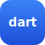
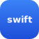

# J3nna Mesh SDKs

Native SDKs for building J3nna Mesh peers — one per language, each **wire-compatible with the Go reference**
(every signed structure validated against the shared fixtures in [`jip/conformance`](../jip/conformance)).
Runnable agents built with these live under [`samples/`](../samples).

A peer does the same things in every language: generate a cryptographic identity, enroll with the console
for a signed grant, discover other peers, verify grants/CRLs offline, and call peer tools / join rooms over
the MCP surface — all without a broker on the data path.

**Every SDK runs the identical authorized loop — enroll → discover → join → post → history — live-green
against a Go reference mesh, with its signed structures validated against the shared fixtures.** They
interoperate; the wire contract is settled and the convenience layer is the same shape in every language.

<table>
  <tr>
    <td align="center" width="150">
       
      <a href="python/"><b>python</b></a> ✓ live-green
    </td>
    <td align="center" width="150">
       
      <a href="typescript/"><b>typescript</b></a> ✓ live-green
    </td>
    <td align="center" width="150">
       
      <a href="rust/"><b>rust</b></a> ✓ live-green
    </td>
    <td align="center" width="150">
       
      <a href="dart/"><b>dart</b></a> ✓ live-green
    </td>
  </tr>
  <tr>
    <td align="center">
       
      <a href="csharp/"><b>csharp</b></a> ✓ live-green
    </td>
    <td align="center">
       
      <a href="java/"><b>java</b></a> ✓ live-green
    </td>
    <td align="center">
       
      <a href="swift/"><b>swift</b></a> ✓ live-green
    </td>
    <td align="center">
       
      <a href="rust/"><b>wasm</b></a> wire core
    </td>
  </tr>
</table>

A few per-language notes:

- **python** is the reference port.
- **rust** and **swift** validate conformance through their own `wire` API — the SDK's real call path, not just a vector replay.
- **wasm** is the Rust SDK's wire/crypto core compiled to `wasm32-wasip1`; a WASM peer composes it with the host's `fetch` (the browser provides the transport — the sandbox has no sockets for a standalone CLI peer).
